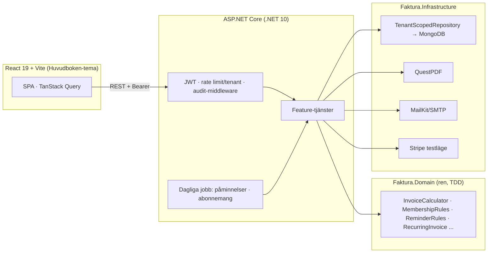

# Faktura


Ett multi-tenant **SaaS-fakturasystem** byggt spec-drivet med [Spec Kit](https://github.com/github/spec-kit):
företag registrerar en organisation, bjuder in teammedlemmar med roller, hanterar kunder och
artiklar, ställer ut fakturor med svensk moms, mejlar dem som PDF, driver in betalning med
automatiska påminnelser och kör abonnemang som fakturerar sig själva — allt strikt
tenant-isolerat, med spårbar aktivitetslogg.

## Funktioner (spec 001–008)

| # | Feature | Kärna |
|---|---|---|
| 001 | **SaaS-skelett** | Self-service-registrering, egen JWT (access + roterande refresh), roller Owner/Admin/Member, inbjudningar med seat-gräns, Stripe-prenumeration (testläge) med signaturverifierade idempotenta webhooks, rate limiting per tenant |
| 002 | **Fakturadomänen** | Kunder, utkast med momsberäkning per sats (25/12/6/0, öresexakt), atomisk obruten nummerserie, låsta skickade fakturor, kreditfaktura med kredittak, QuestPDF |
| 003 | **E-postutskick** | Mejla faktura som PDF-bilaga (SMTP/MailKit bakom `IEmailSender`), utskickshistorik, Reply-To = avsändaren |
| 004 | **Betalningspåminnelser** | Manuell knapp + dagligt jobb (opt-in per organisation, max en automatisk per faktura), original-PDF bifogas |
| 005 | **Artikelregister** | Artiklar (unikt artikelnummer per tenant via partial-index) förifyller fakturarader enligt snapshot-principen; enhet på rad + PDF |
| 006 | **Dashboard** | Utestående/förfallet/betalt i år + 12-månaders omsättningsgraf (ren SVG) + senaste fakturor |
| 007 | **Återkommande fakturor** | Abonnemangsmotor: genererar, skickar och mejlar fakturor per intervall (mån/kvartal/år); ikappkörning utan dubbletter; paus/slutdatum |
| 008 | **Audit trail** | Append-only aktivitetslogg per organisation (vem gjorde vad när), fångad av middleware |

Plus: **OpenAPI/Scalar** (`/scalar`), **Serilog** strukturerad loggning, **health checks**
(`/health`, `/health/ready`), **Docker Compose**-miljö och **E2E-tester i CI**.

## Arkitektur



**Bärande principer** (se [constitution](.specify/memory/constitution.md)):

- **Tenant-isolering i datalagret** — varje dokument bär `tenantId`; alla queries går genom
  `TenantScopedRepository` som tvingar filtret. TenantId härleds *enbart* ur JWT, aldrig från klienten.
- **Domänlogik utan infrastruktur** — moms, RBAC, påminnelseregler och abonnemangsscheman är rena
  klasser, byggda test-först.
- **Oföränderlighet** — skickade fakturor kan aldrig ändras; rättelse sker via kreditfaktura;
  aktivitetsloggen är append-only.
- **Datadriven plan-gating** — Free/Pro-gränser (seats, rate limits) bor i konfiguration, inte i if-satser.

## Teststrategi

| Nivå | Verktyg | Vad som bevisas |
|---|---|---|
| Domän-enhetstester | xUnit | Momsberäkning utan öresdifferens, RBAC-matris, påminnelse-/abonnemangsregler |
| API-integration | `WebApplicationFactory` + in-memory-repos + styrbar klocka | Hela HTTP-pipelinen: auth, isolering (A når aldrig B), 401/403/409/429, jobbens dubblettskydd |
| Riktig databas | **Testcontainers** (MongoDB) | Index-semantik (unikt partial-index), tenant-filter på riktiga queries, nummerseriens atomicitet under parallellism |
| Frontend | Vitest + Testing Library | API-klient, skyddade routes, login-flöde |
| E2E | **Playwright** mot Docker Compose-stacken i CI | Registrera → kund → faktura → skicka i riktig webbläsare |

## Kör hela stacken med ett kommando

```bash
docker compose up --build
```

| Tjänst | URL |
|---|---|
| Appen (web) | http://localhost:8081 |
| API + Scalar-docs | http://localhost:5080 · `/scalar` · `/health/ready` |
| Mailpit (fångar alla mejl) | http://localhost:8025 |
| MongoDB | mongodb://localhost:27017 |

## Lokal utveckling (utan Docker)

Krav: .NET 10 SDK, Node 20+, MongoDB lokalt. Hemligheter via miljövariabler — se
`backend/src/Faktura.Api/appsettings.example.json`. **Checka aldrig in nycklar.**

```bash
cd backend && dotnet test && dotnet run --project src/Faktura.Api   # API på :5080
cd frontend && npm ci && npm test && npm run dev                    # SPA på :5173
cd frontend && npm run e2e   # kräver compose-stacken uppe
```

## Design: "Huvudboken"

Frontenden är formgiven som en svensk kassabok: varmt papper och bläck, stämpelröd accent,
serifrubriker, tabular-nums så belopp radar upp sig, perforeringslinjer och stämpel-lika
statusmarkeringar (FÖRFALLEN, BETALD …). Allt token-drivet — inga hårdkodade färger i komponenter.

## Arbetssätt

Spec-driven utveckling: **spec → plan → tasks → implement** per feature (se [specs/](specs/)),
TDD för domänlogik, GitFlow med en PR per spec och grön CI som merge-gate.
Deploy-mål: Cloudflare Pages + Render + MongoDB Atlas via GitHub Actions (se
[.github/workflows/](.github/workflows/)).
